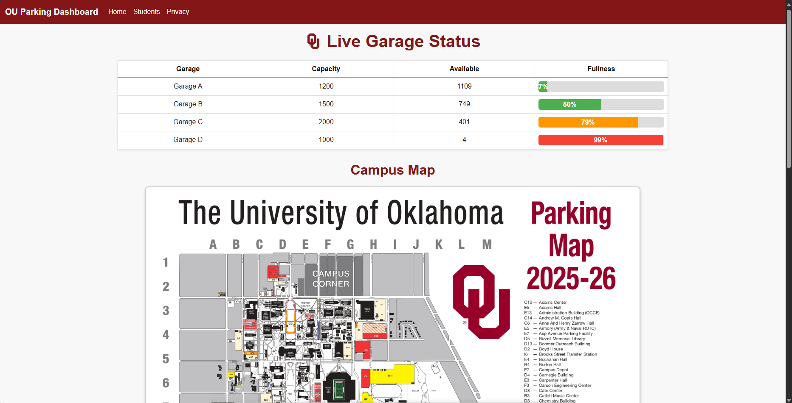
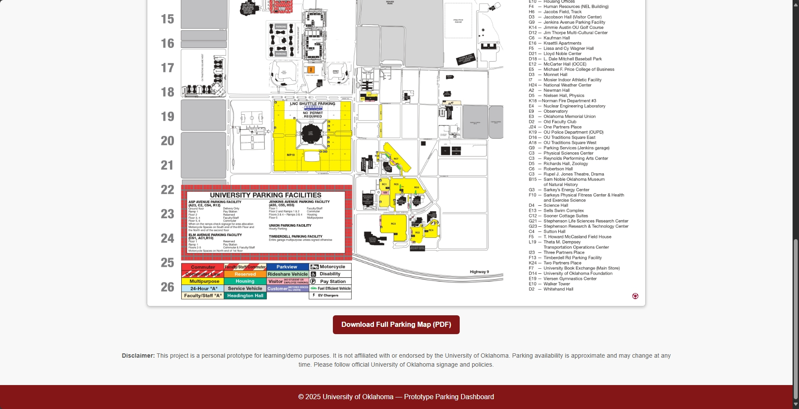

# OU Parking Dashboard  

A live parking garage dashboard prototype for the **University of Oklahoma**, showing garage capacity, availability, and % fullness in real time.  

Styled with OU’s official red-and-white theme for a familiar campus look.  
Built with **ASP.NET Core MVC, EF Core, and Razor Views**.  
Includes dynamic live updates via API polling and an integrated campus parking map.  

---

## Preview  

### Dashboard View 1  
  
*(Live garage capacity with color-coded bars and % fullness)*  

### Dashboard View 2  
  
*(Integrated campus parking map with garage availability)*  

---

## Why This Project?  

I built this to demonstrate how campus parking data can be made more **accessible and user-friendly** for students, staff, and visitors.  
It’s also a showcase of my skills in:  

- Full-stack web development (**ASP.NET Core MVC + EF Core**)  
- Database design and seeding (SQL Server LocalDB)  
- Frontend UI with live API updates (JavaScript + Razor)  
- Applying university branding/themes to custom applications  

---

## Tech Stack  

- **.NET 8 / ASP.NET Core MVC**  
- **Entity Framework Core** (with seeding & mock data service)  
- **SQL Server LocalDB**  
- **C#, JavaScript, Razor Views, Bootstrap-style CSS**  

---

## Getting Started 

```bash
git clone https://github.com/YOUR-USERNAME/ou-parking-dashboard.git
cd ou-parking-dashboard
dotnet ef database update
dotnet run
